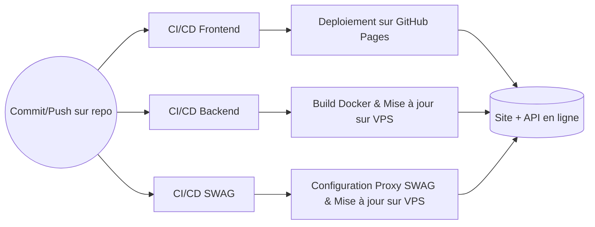

# Projet Association Sight

Bienvenue dans le projet **Association Sight**. Ce site web a pour but de **présenter plusieurs associations** et de permettre aux utilisateurs de soutenir gratuitement l'association de leur choix.  
Il s'agit d'un **site web complet** comprenant un **frontend** en React/TypeScript/Tailwind CSS (compilé via Vite) et un **backend** (API) déployé sur un VPS, ainsi qu'un **reverse proxy** (SWAG).

---

## Sommaire

1. [But du site](#but-du-site)  
2. [Stack et structure du projet](#stack-et-structure-du-projet)  
3. [Commandes développeur](#commandes-développeur)  
   - [Lancer le site web en local](#lancer-le-site-web-en-local)  
   - [Lancer l'API backend en local](#lancer-lapi-backend-en-local)  
   - [Déployer le site au complet](#déployer-le-site-au-complet)  
4. [Workflow CI/CD](#workflow-cicd)  
   - [Schéma Mermaid](#schéma-mermaid)  

---

## But du site

Le site **Association Sight** répond à un besoin de présentation rapide de **3 associations** (ou plus) et propose aux utilisateurs :

- Un **design épuré**, avec un header accrocheur et un affichage des cartes d’associations.  
- Des pages de détail permettant à l’utilisateur de **soutenir** une association gratuitement, en fournissant quelques informations.  
- Une **API** backend pour enregistrer les soutiens (votes, petits mots, emails, etc.).  

---

## Stack et structure du projet

Le projet est découpé en **trois grandes parties** :  
1. **Frontend** (React, TypeScript, Tailwind, Vite)  
2. **Backend** (Python ou Node, Dockerisé)  
3. **SWAG** (Serveur Web / Reverse Proxy) pour exposer proprement l’API.  

### Arborescence principale

```
.
├── .github/workflows
├── ansible
├── backend
├── frontend
├── README.md
└── swag
```

- **github/workflows/** : Fichiers de configuration pour les workflows GitHub Actions, permettant l'intégration continue (CI) et le déploiement continu (CD) du projet.
- **ansible/** : Scripts et playbooks Ansible pour déployer le backend, le reverse proxy, etc.  
- **backend/** : Code et configuration Docker pour l’API (Dockerfile, docker-compose.yaml).  
- **frontend/** : Application web (React + TS + Tailwind + Vite).  
- **swag/** : Configuration du proxy (SWAG).  

---

## Commandes développeur

### Lancer le site web en local

1. **Installer les dépendances** (dans `frontend/`) :

   ```bash
   cd frontend
   npm install
   # ou
   yarn
   ```

2. **Lancer le serveur local** :

   ```bash
   npm run dev
   # ou
   yarn dev
   ```

   Par défaut, Vite sert le projet sur `http://localhost:5173`.

### Lancer l’API backend en local

1. Allez dans le dossier `backend`.
2. Vérifiez que vous avez bien les dépendances installées (voir `requirements.txt` si c’est du Python, par exemple).  
3. **Option A** (Docker) :  

   ```bash
   docker-compose up -d
   ```
   
   Le backend devrait tourner sur `http://localhost:5000` (selon la config).  

4. **Option B** (Sans Docker, si Python) :

   ```bash
   pip install -r requirements.txt
   python main.py
   ```
   
   Le serveur démarre alors en local.

### Déployer le site au complet

Le déploiement complet implique :

1. **Frontend** sur GitHub Pages  
   - Dans `frontend/package.json`, vous pouvez utiliser un script ou l’action GitHub pour **build** et **deploy**. Exemple :  
     ```bash
     npm run build
     # Le dossier dist est généré
     # puis script pour déployer sur GitHub Pages via une action ou via npm run deploy
     ```

2. **API sur un VPS**  
   - Vous pouvez utiliser `docker-compose.yaml` dans `backend/`. Connectez-vous à votre VPS, clonez votre repo et exécutez :  
     ```bash
     docker-compose up -d
     ```  
   - Ou utilisez les **playbooks Ansible** (`ansible/backend-deploy.yaml`) pour déployer automatiquement l’image Docker sur le VPS.

3. **SWAG** pour le reverse proxy**  
   - Déployer SWAG (dans `swag/`) via `docker-compose` ou via Ansible (`ansible/swag-deploy.yaml`).  
   - Configurer votre nom de domaine (DNS) pour pointer sur le VPS, et renseigner la configuration du proxy dans `proxy-confs`.

---

## Workflow CI/CD

Chaque **commit** sur le dépôt déclenche une **intégration continue** (CI) qui :  
1. **Build** l’application frontend,  
2. Met à jour le **conteneur Docker** du backend si besoin,  
3. Déploie le **frontend** sur GitHub Pages,  
4. Met à jour les fichiers de configuration sur le VPS (selon votre pipeline).

### Schéma Mermaid

Voici un schéma **Mermaid** résumant le workflow :



- **A** : Un commit/push sur le dépôt GitHub déclenche les 3 pipelines en parallèle.  
- **B (CI/CD Frontend)** : Build du front et déploiement sur GitHub Pages.  
- **C (CI/CD Backend)** : Build de l’image Docker, push, puis mise à jour sur le VPS (pull & restart).  
- **D (CI/CD SWAG)** : Mise à jour de la configuration du proxy SWAG pour le nouveau backend et déploiement éventuel.  
- **E, F, G** : Résultats respectifs de chaque pipeline.  
- **H** : Le site et l’API sont accessibles (front sur GitHub Pages, API derrière SWAG).  
---

## Conclusion

Ce projet **Association Sight** est conçu pour être **rapide** à mettre en place et **simple** à maintenir. Les technologies utilisées (React/TS + Tailwind + Vite) permettent un **développement frontend** fluide, tandis que la **dockerisation** du backend facilite le **déploiement**. Le **reverse proxy** (SWAG) s’occupe d’exposer proprement l’API à travers un VPS.  

Pour toute question ou contribution, n’hésitez pas à ouvrir une **issue** ou à proposer une **pull request**.  
Bonne navigation !